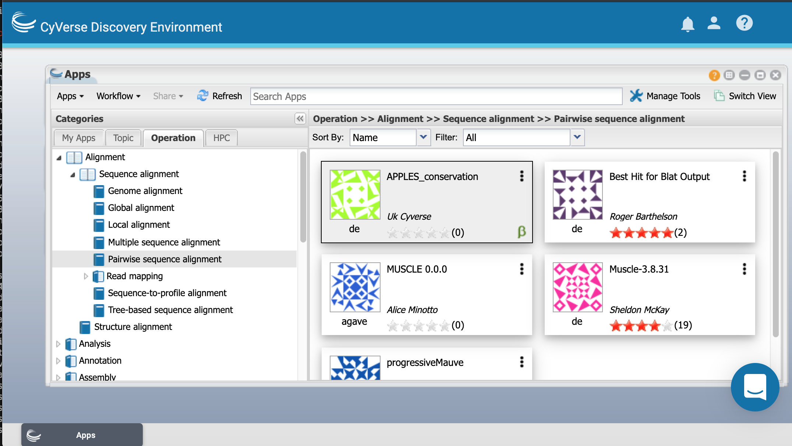
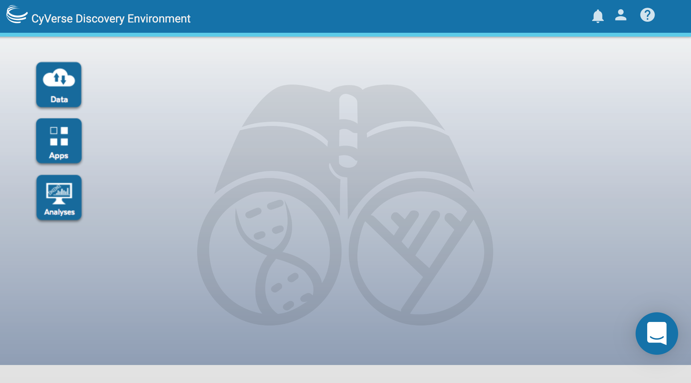
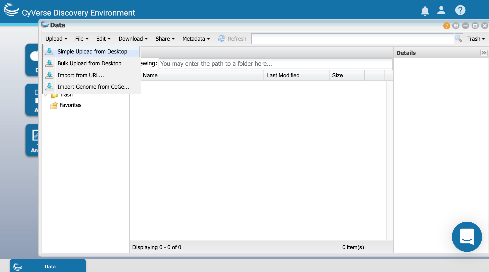
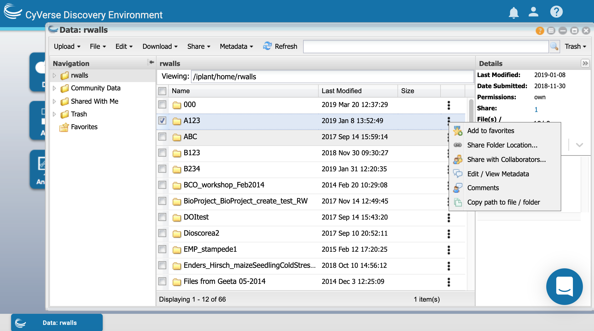

.. include:: ../cyverse_rst_defined_substitutions.txt

|CyVerse_logo2|_

|Home_Icon2|_
`Learning Center Home <http://learning.cyverse.org/>`_

**Discovery Environment**
-------------
.. #### Comment: Overview of the DE and hands on of basic features
|DE_icon|_

DE Features
=============
 - Use hundreds of bioinformatics Apps without the command line (or with, if you prefer)
 - Batch and interactive modes
 - Seamlessly integrated with data and high performance computing – not dependent on your hardware
 - Create and publish Apps and workflows so anyone can use them
 - Analysis history and provenance – “avoid forensic bioinformatics”
 - Securetly and easily manage, share, and publish data 
 
DE Basics Walkthrough
===============
 - Log in at https://de.cyverse.org/

|DE_blank|

Data Window
~~~~~~~~~~~~~~`
 - Open the data window and upload a file:

|DE_data_upload|

 - `Create a new text file <https://wiki.cyverse.org/wiki/display/DEmanual/Creating+New+Files+and+Folders>`_ and share it with someone in the class:

|DE_dots_menu|

 - `Download <https://wiki.cyverse.org/wiki/display/DEmanual/Downloading+Files+and+Folders>`_ the shared file.
 - `Collaborator lists <https://wiki.cyverse.org/wiki/display/DEmanual/Adding+and+Deleting+Users+from+the+Collaborators+List+in+Preferences>`_
 
Apps Window
~~~~~~~~~~~~~~`
 - Find an app by browsing:

|DE_apps_operation|

 - Find an app by `searching <https://wiki.cyverse.org/wiki/display/DEmanual/Searching+for+an+App,+Workflow,+or+Tool>`_
 - `Launch and analysis <https://wiki.cyverse.org/wiki/display/DEmanual/Using+Apps>`_ using the word count app
 
|DE_word_count|

Analyses Window
~~~~~~~~~~~~~~`

 - Open the `Analyeses window ,https://wiki.cyverse.org/wiki/display/DEmanual/Using+the+Analyses+Window>`_ and view analysis status:

|DE_analyses|

 - `Relaunch or cancel <https://wiki.cyverse.org/wiki/display/DEmanual/Relaunching%2C+Canceling%2C+and+Deleting+Analyses%2C+Viewing+Analysis+Outputs+and+Info>`_ an analysis
 - `Share an analysis <https://wiki.cyverse.org/wiki/display/DEmanual/Sharing+and+Unsharing+an+Analysis>`_

Using metadata in the DE
========================

 - Add metadata:
 
 - Metadata templates:
 
 - Search metadata:
 
Create a Team/Group
====================

Self-paced lessons and additional resources
-----------------
Creating a group project on CyVerse
DE Quickstart
DE Manual

----

..
	#### Comment: Suggested style guide:
	1. Steps begin with a verb or preposition: Click on... OR Under the "Results Menu"
	2. Locations of files listed parenthetically, separated by carets, ultimate object in bold
	(Username > analyses > *output*)
	3. Buttons and/or keywords in bold: Click on **Apps** OR select **Arabidopsis**
	4. Primary menu titles in double quotes: Under "Input" choose...
	5. Secondary menu titles or headers in single quotes: For the 'Select Input' option choose...
	####

----

**Fix or improve this documentation:**

- On Github: |Github Repo Link|
- Send feedback: `Tutorials@CyVerse.org <Tutorials@CyVerse.org>`_

----

.. Comment: Place Images Below This Line
   use :width: to give a desired width for your image
   use :height: to give a desired height for your image
   replace the image name/location and URL if hyperlinked

 .. |DE_icon| image:: ../img/de/de-icon.png
     :width: 100
     :height: 88
 .. _DE_icon: https://de.cyverse.org/de/
    
.. |Static image| image:: ./img/IMAGENAME.png
    :width: 25
    :height: 25

.. |DE_analyses| image:: ../img/IMAGENAME.png../img/de/DE_analyses.png

.. |DE_word_count| image:: ..img/de/DE_word_count.png

.. Comment: Place URLS Below This Line

   # Use this example to ensure that links open in new tabs, avoiding
   # forcing users to leave the document, and making it easy to update links
   # In a single place in this document

   .. |Substitution| raw:: html # Place this anywhere in the text you want a hyperlink

      <a href="REPLACE_THIS_WITH_URL" target="blank">Replace_with_text</a>

.. |Github Repo Link|  raw:: html

   <a href="https://github.com/CyVerse-learning-materials/foss-2019/tree/master/CyVerse/de.rst" target="blank">Github Repo Link</a>
