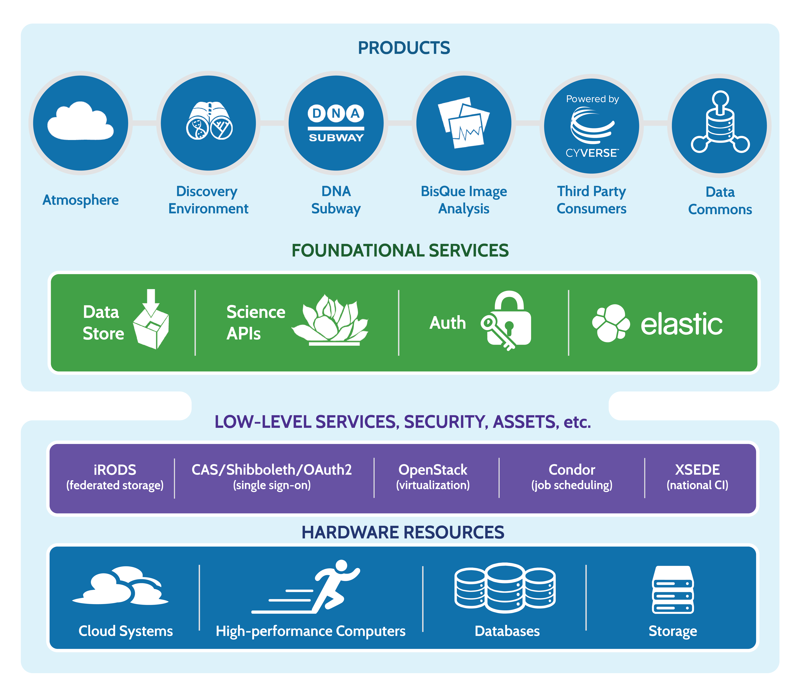

|cyverse logo|

**Introduction to CyVerse**
===========================

**Vision** 

Transforming Science through Data-Driven Discovery.

**Mission**

To design, deploy, and expand a national Cyberinfrastructure for Life Sciences research, and to train scientists in its use.

**Evolution of CyVerse**

|evolcyverse|

we are NSF funded. we are your collaborators, not commercial

**What is Cyberinfrastructure?**
^^^^^^^^^^^^^^^^^^^^^^^^^^^^^^^^

cyverse is built for data

|layer cake|

community priorities

where we are located

`User Portal <user.cyverse.org>`_
^^^^^^^^^^^^^^^^^^^^^^^^^^^^^^^^^

Create and manage your CyVerse account
    - Reset your password
    - Add an email address to your account
    - Change your name or username
    - Change your institution, department, position
    - Change your CyVerse subscriptions

Manage access to CyVerse platforms/services
    Some CyVerse services (such as Atmosphere) have additional restrictions and access must be 'turned on'.
    
User portal forms
    - Request a Data Store allocation increase
    - Request a community released data folder
    - Request a workshop or webinar
    - Reserve Atmosphere cloud resources for workshops or classes
    - Request an External Collaborative Partnership (ECP)
    - get Powered by CyVerse

Manage workshops you've attended or hosted

Access Powered by CyVerse projects

`Data Store <https://de.cyverse.org/de/>`_
^^^^^^^^^^^^^^^^^^^^^^^^^^^^^^^^^^^^^^^^^^

|datastorelogo|

Securely store data for active analyses or sharing with your collaborators.
 
    - Upload, download and share your data
        - DE simple upload/download. Convenient but not good for large files.
        - Cyberduck is a third-party software with graphic interface for transferring data. Available for Mac and Windows.
        - iCommands is more powerful/flexible, good for large transfers but requires some command line knowledge
    - Data limit of 100 GB (can request increase up to 10 TB)
    - Data storage is integrated into the Discovery Environment (where analyses are run).

`Discovery Environment <https://de.cyverse.org/de/>`_
^^^^^^^^^^^^^^^^^^^^^^^^^^^^^^^^^^^^^^^^^^^^^^^^^^^^^

|DElogo|

Use hundreds of bioinformatics apps and manage data in a simple web interface.
    - Provides graphic interface for bioinformatics tools for scientists with no command line experience
    - User extensible. Users can add their own tools and make their own apps.
    - VICE (Visual and Interactive Computing Environment) for interactive use of Jupyter notebooks, RStudio and the terminal.

`Atmosphere <https://atmo.cyverse.org/application/images>`_
^^^^^^^^^^^^^^^^^^^^^^^^^^^^^^^^^^^^^^^^^^^^^^^^^^^^^^^^^^^

|atmologo|

Create a custom cloud-based scientific analysis platform or use a ready-made one for your area of scientific interest.

    - Cloud computing for life science
    - 100s of pre-built images
    - Fully customize your software setup
    - what is an image?
    - what is an instance?
    - virtual machine
    - allocation basics
    - not automatically added--need to go to user portal
    - limited to US
        
`Bisque <https://bisque.cyverse.org/client_service/>`_
^^^^^^^^^^^^^^^^^^^^^^^^^^^^^^^^^^^^^^^^^^^^^^^^^^^^^^

|bisquelogo|

Exchange, explore, and analyze biological images and their metadata.
    - image data analysis and management

`DNA Subway <https://dnasubway.cyverse.org/>`_
^^^^^^^^^^^^^^^^^^^^^^^^^^^^^^^^^^^^^^^^^^^^^^

|dnasubwaylogo|

Teach classroom-friendly bioinformatics for genome analysis, DNA Barcoding, and RNA-Sequencing.

    - educational

`Data Commons <http://datacommons.cyverse.org/>`_
^^^^^^^^^^^^^^^^^^^^^^^^^^^^^^^^^^^^^^^^^^^^^^^^^

|DClogo|

Access discoverable and reusable data with metadata features and functions.

`Powered by CyVerse <http://www.cyverse.org/powered-by-cyverse>`_
^^^^^^^^^^^^^^^^^^^^^^^^^^^^^^^^^^^^^^^^^^^^^^^^^^^^^^^^^^^^^^^^^

|PBlogo|

 Third-party projects can leverage the CyVerse cyberinfrastructure components to provide services to their users. 

- science APIs
    - for developers

The CyVerse Learning Center
^^^^^^^^^^^^^^^^^^^^^^^^^^^^^^^

|LClogo|

`The CyVerse Wiki <https://wiki.cyverse.org>`_
^^^^^^^^^^^^^^^^^^^^^^^^^^^^^^^^^^^^^^^^^^^^^^

This collaborative documentation site is used to record important information about CyVerse, its products and services, and community collaborators and their projects. Anyone with a CyVerse account is welcome to help out.

workshops

    
Intercom
^^^^^^^^^^^^

|intercomlogo|

Intercom is our live-chat user support app. You will find the Intercom 'smiley' logo in the bottom right corner of the Discovery Environment, Atmosphere, user portal

.. |cyverse logo| image:: ../img/cyverse_cmyk.png
  :width: 750
  :height: 100

.. |datastorelogo| image:: ../img/data_store/datastore-icon.png
  :width: 175
  :height: 200

.. |DElogo| image:: ../img/de/de-icon.png
  :width: 200
  :height: 175

.. |atmologo| image:: ../img/atmosphere/atmosphere-icon.png
  :width: 200
  :height: 150

.. |bisquelogo| image:: ../img/bisque/bisque-icon.png
  :width: 200
  :height: 200

.. |dnasubwaylogo| image:: ../img/dna_subway/dnasubway-icon.png
  :width: 200
  :height: 150

.. |DClogo| image:: ../img/DataCommons_DrkBlue.png
  :width: 200
  :height: 200

.. |PBlogo| image:: ../img/PoweredbyCyverse_LogoSquare.png
  :width: 175
  :height: 200

.. |LClogo| image:: ../img/Learningcenter_DkBlue.png
  :width: 200
  :height: 200

.. |intercomlogo| image:: ../img/intercomlogo.png
  :width: 100
  :height: 100

.. |evolcyverse| image:: ../img/evolutionofcyverse.png
  :width: 750
  :height: 200
