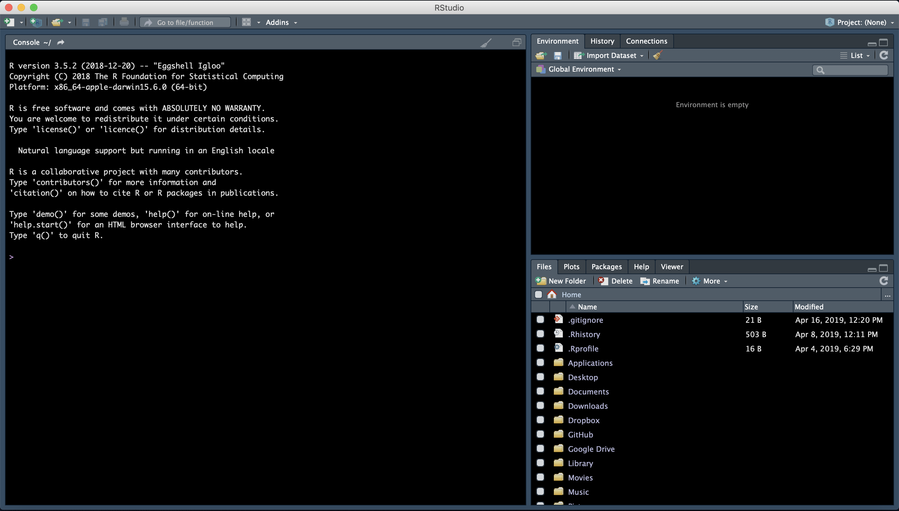

**Introduction to R & RStudio**
===============================

**Setup**
---------
1. You need to download R & RStudio:

   - `Download R <https://cran.r-project.org/>`_
 
   - `Download R Studio <https://www.rstudio.com/products/rstudio/download/#download>`_

2. Move to the Applications folder.

3. Open RStudio. 

Go to Session -> Set Working Directory to set where you will pull data files from and/or save your code.

**Introduction**
----------------

We will learn how to:
- navigate & interact with R Studio
	- UI of R Studio
	- how to use "help"
	- install packages
	- upload data
- data structures
	- strings, factors, numbers, integers
	- vectors & arrays
	- matrices & lists
- explore data
	- data manipulation
	- data subsetting 

R Studio makes using R programming language easier to interact with and to keep track of projects. 

**Navigating & Interacting with R Studio**
------------------------------------------

Basic Layout
~~~~~~~~~~~~

|R Console|

The basic layout includes:
- Interactive R Console (left) <- most of your time will be spent here
- Environment/History (upper right)
- Files/Plots/Packages/Help/Viewer (lower right)

Once you open a new R script (File -> New File -> R Script), and editor panel should appear in the upper left.'
R scripts are saved as .$R
These can be rearranged by going into Preferences.

Calculating with R
~~~~~~~~~~~~~~~~~~

Using R as a calculator

.. code-block:: R

	> 2+2
	> 4
	
	> 1 +
	> +
	
	> 2/10000
	> 2e-04

Exercise::

1. What is the output for 5e3?
2. How would you add 5 and 3 and multiply the sum by 2?

Comparing things: Using logical operators

.. code-block:: R

	> 1 == 1
	> TRUE
	
	> 1 < 2
	> TRUE
	
	> 1 >= 9
	> FALSE

Other logical conditions: "&", "|", "!"

HELP!
~~~~~
help() is the most useful function in R. You will likely use this and Stack Overflow to help solve most of your problems (not life problems, you're on your own for that).

.. code-block:: R

	help(plot)

Parts of the help file:
- Description
	This describes what the function does.

- Usage
	This describes the formula and arguments for the function

- Arguments
	These are different inputs into the function that can be used.
	The argument (e.g., x, y) do not always need to be specified.
	For example, 

.. code-block:: R

	plot(x = data.x, y = data.y)
	plot(data.x, data.y)

are the same thing.

- Details
	Usually these state the outputs of the function, or any other nuance within the function that may not be obvious.

- See also
	This will link to similar functions, or functions that can be called with this function.

- Examples
	Some are better than others. Generally, though, this gives examples of the arguments most commonly used in the function.

Installing packages
~~~~~~~~~~~~~~~~~~~

.. code-block:: R

	install.packages("packageName")

Often installing a package will automatically install all the dependencies as well.

You can see installed packages with the following command:

.. code-block:: R

	installed.packages()

Uploading Data
~~~~~~~~~~~~~~

There are many ways to upload data in the R environment depending on the document type you have.

.. code-block:: R

	#General reading
	read.table("dataFile.ext)

Exercise:

	1. What are the arguments for read.table?
	2. What arguments would you use to upload a .csv file using read.table()?

.. code-block:: R

	#.csv files
	read.csv()
	
	#reading in from an online source
	read.table(path/to/file)
	
**Data Structures**
-------------------

Types of Data
~~~~~~~~~~~~~

Numeric - numerical values include decimals and can have calculations performed on them
Integer - whole numbers only, and can also have calculations performed on them
Factor - a way to perform groupings on data (e.g., group by age, gender, or other types)
Character - text that cannot have calculations done on them
String - a sequence of characters or numbers

Exercise:

	1. What does the following return? What does it mean?

.. code-block:: R

	str(10)
	str("10")
	
	2. Try calculations on the following. What works and what doesn't? Why or why not?

.. code-block:: R

	10*2
	"10"*2

Errors v. Warnings: 
	Errors are given when R cannot perform the calculation
	Warnings mean that the function has run but perhaps with some issues.

Storing Variables
~~~~~~~~~~~~~~~~~
We can assign any of the types of data above in a "place holder". 
Variables are assignee using "<-".

For example, we can store the number 10 in a letter to use later

.. code-block:: R

	a <- 10
	
**NOTE** Do not create variables that are already functions or arguments (e.g., c, T, F).
**NOTE** Do not overwrite variables.

Exercise:

	1. What does x*2 give you?

Vectors & Lists
~~~~~~~~~~~~~~~~
These are variables; Just how to look at data; data types and automatically transfer
every thing in R is an object; float int string true

Variables and functions can have vectors as inputs. Vectors are 1-D object that contain "*like*" data types.
You can create a string of variables and add to a vector using c(), which is short for concatenate.

Exercise:

	1. What are the outputs of 

.. code-block:: R

	x <- c(1, 2, 3, 4, 5)
	y <- 1:5
	z <- seq(1, 5, 1)

A list is similar to a vector, but can store different "*types*" of data.

.. code-block:: R

	m <- list("a", 10, "10", a)

	2. What is m?

Matrices & Arrays
~~~~~~~~~~~~~~~~
A matrix is a 2-D object of similar type of data.
An array is more than 2-D and can contain many types of data types and not be even in column length.

Array example

.. code-block:: R

	# Create two vectors of different lengths.
	vector1 <- c(5,9,3)
	vector2 <- c(10,11,12,13,14,15)
	
	# Take these vectors as input to the array.
	result <- array(c(vector1,vector2),dim = c(3,3,2))
	print(result)

Creating a dataframe using data.frame()

Exercise:

	1. Play with the different types of data in the data.frame(). What happens?

You can combine dataframes:

.. code-block:: R

	hello <- data.frame (1:26, letters, words = c("hey", "you")) 
	hi <- data.frame(1:26, letters, c("hey", "you"))
	howdy <- data.frame(hello, hi)

Adding columns and rows using cbind() and rbind()

.. code-block:: R

	cbind(hello, "goodbye")
	
We can call columns using "$" in the form of data.frame$column or call them using the modifier [row#, column#]
Calling columns:

.. code-block:: R

	hello[,2]
	hello$letters
	
**ATOMIC VECTORS** are vectors which cannot be simplified anymore, and therefore "$" cannot be used on them. Yes, this error happens a lot. Yes, it is frustrating. Good luck.

Likewise, columns are rows can be removed using "-" as a modifier

.. code-block:: R

	hello[,-2]

What is the output?

You can save a dataframe using write.table() and write.csv().

**NOTE** do not overwrite your dataset!!
If you rerun a script, you may overwrite your results or new data. Put a "#" after use!

Indexing follows: [,] or [[]]

The R Environment
~~~~~~~~~~~~~~~~~

You can view your environment either by looking at the upper left tab or by typing the following:

.. code-block:: R

	ls()

You can remove objects using the rm() function.

Exercise:

	1. How would you remove "a" from the environment? How would you check?

**Exploring Data**
------------------

Data Manipulation
~~~~~~~~~~~~~~~~~

Create the following dataframe:

.. code-block:: R

	cats <- data.frame(coat = c("calico", "black", "tabby"), 
                    weight = c(2.1, 5.0,3.2), 
                    likes_string = c(1, 0, 1))
    class(cats)

Let's add!

.. code-block:: R

	cats$weight + 2
	cats$coat + cats$coat

What are the outputs?

We can use the function "paste" to make more complex strings:

.. code-block:: R

	paste("My cat is", cats$coat)

What is the output?

The most useful ways to view your data:
View(dataframe)
str(dataframe)
summary(dataframe)
head(dataframe)

Subsetting Data
~~~~~~~~~~~~~~~

Exercise:

	1. What is the function for subsetting data?

.. code-block:: R

	x <- c(a=5.4, b=6.2, c=7.1, d=4.8, e=7.5) # we can name a vector 'on the fly'
	#x is a vector
	x[c(a,c),]	
	x[names(x) == "a"]
	x[names(x) == "a" | "c"]
	x[names(x) != "a"]

What are the outputs?

